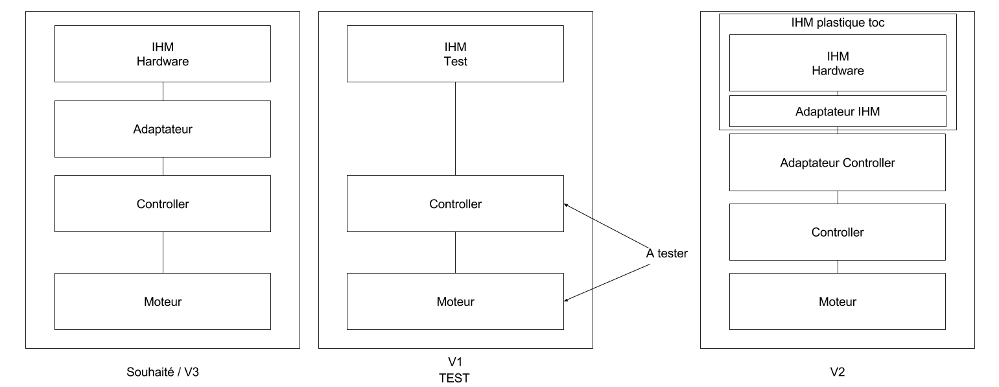

# TD AOC - Metronome

## Responsabilités du Moteur

* Gérer le temps
    * Gérer le tempo
    * Gérer le nombre de temps par mesure
* Emettre des signaux périodiques
    * Toutes les (60/tempo) secondes un premier signal (marquer le temps)
    * Toutes les (nbtemps mesure) un second signal (marquer la mesure)

## Responsabilités du Controleur

* Capter les signaux du Moteur
* Les faire manifester par l'IHM
* Interprête les actions de l'utilisateur sur l'IHM
    * Réglage du tempo
    * Réglage du nombre de temps par mesure
* Maintient la cohérence des vues sur l'état du moteur

## Collaboration Moteur - Controleur

### Moteur
