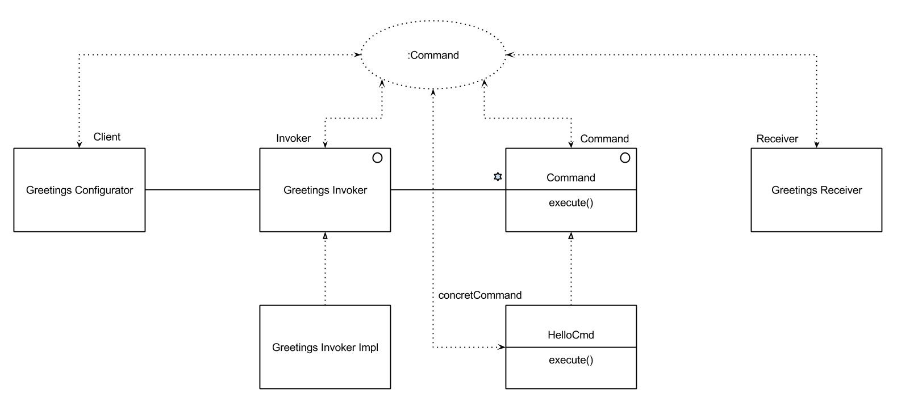

# AOC

## Liens utiles
https://github.com/nplouzeau/  
https://github.com/nplouzeau/dugl

## Révision Pattern M1
### Pattern Command
Le pattern command est constitué de 4 parties
* command
* concretCommand
* receiver
* invoker

### Pattern Factory
