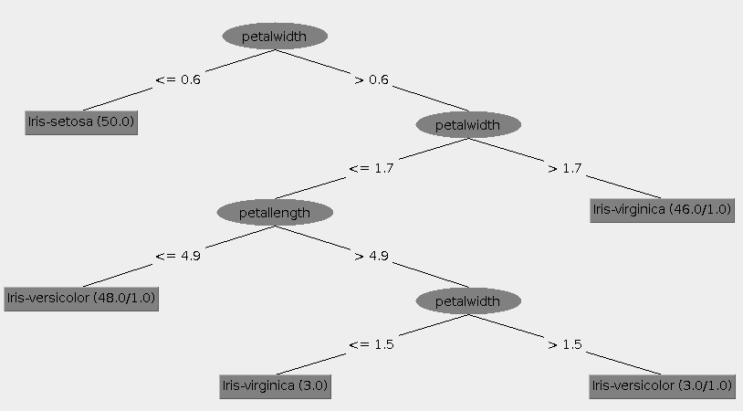
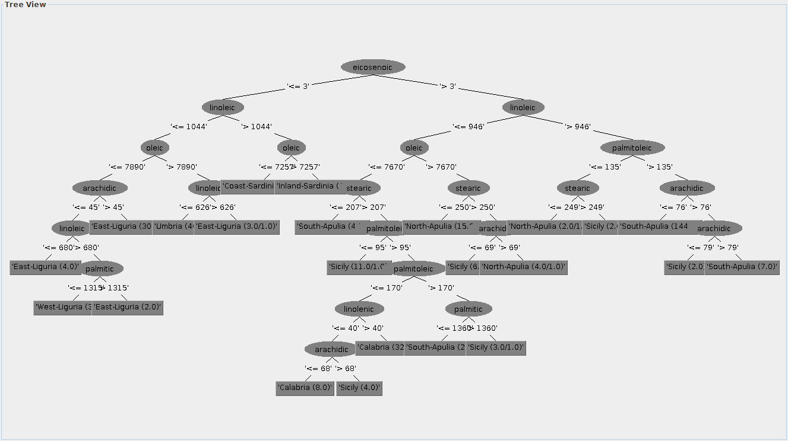
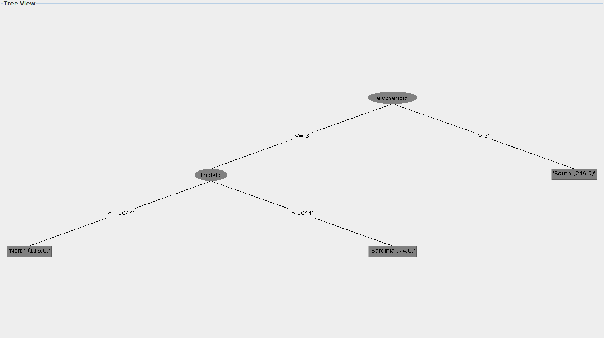
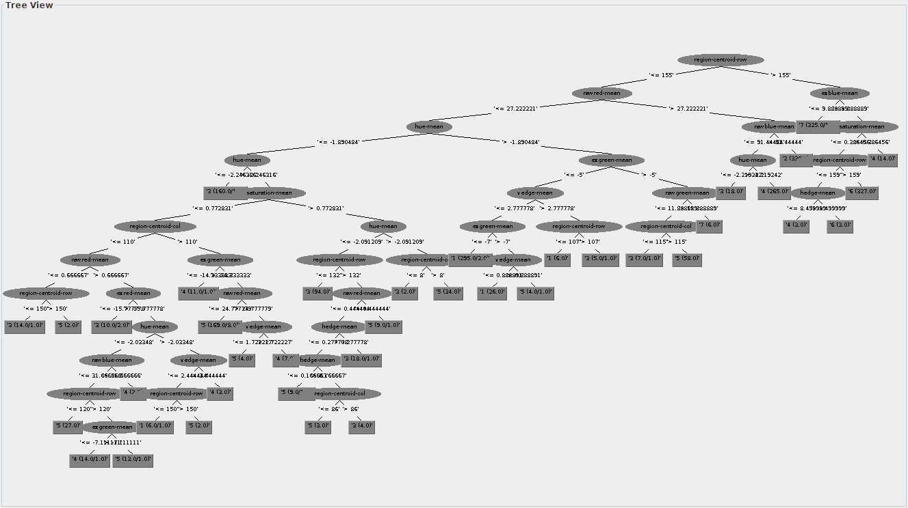
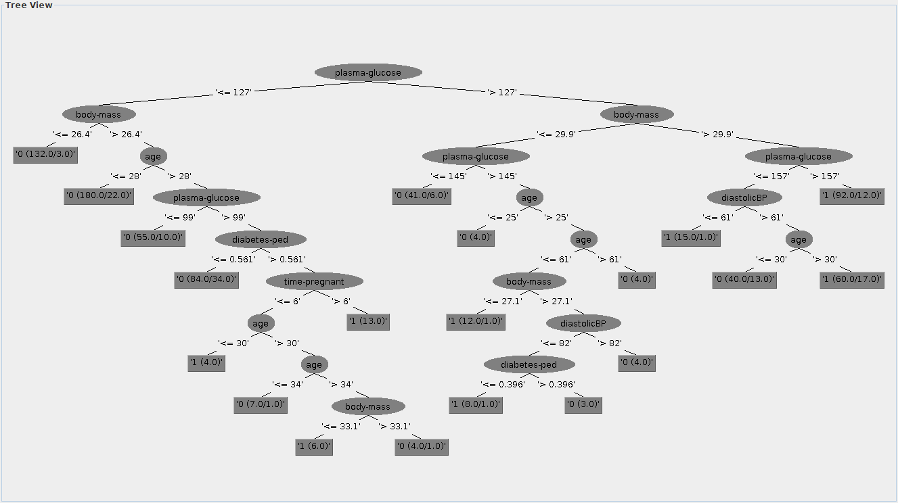

# Partie I - Classification supervisée

## I.1 - Un premier ensemble d'exemples simples

### Iris
#### Naive Bayes :
Avec cet algorithme, nous remarquons que les types d'Iris peuvent être suffisamment différenciés par la longueur de leurs pétales. En effet, malgré quelques erreurs de prédiction entre les iris versicolor et virginica, les trois groupes d'iris sont definis.

On nous indique plus précisément que dans 96% des cas (soit 6 erreurs), Naive Bayes avec le kernel estimator classifie correctement les iris.

Vous trouverez ci-dessous un détail des prédictions (sachant que chaque espèce était représentée 50 fois).

| | Setosa | Versicolor | Virginica |
|---|---|---|---|
| Setosa | **50** | 0 | 0 |
| Versicolor | 0 | **47** | 3 |
| Virginica | 0 | 3 | **47** |

#### k-NN :
Grâce à cet algorithme, on peut choisir le k. Avec des k comme 1, 3, 5 ou 9, on obtient le même pourcentage d'erreurs qu'avec Naive Bayes.  
Cepandant, avec un k=7, l'algorithme a pu correctement classer les iris dans 96,6% des cas (soit 5 erreurs).

| | Setosa | Versicolor | Virginica |
|---|---|---|---|
| Setosa | **50** | 0 | 0 |
| Versicolor | 0 | **49** | 1 |
| Virginica | 0 | 4 | **46** |

#### C4.5 :
Cet algorithme nous permet de décrire la classification des espèces d'iris grâce à un arbre de décision que vous trouverez ci-dessous.

Nous observons sur l'arbre de décision que l'algorithme sépare d'abord les iris Setosa des deux autres espèces par la largeur de leurs pétales puis qu'il sépare ensuite les deux espèces par la largeur et la longueur de leur pétales.

Concernant le taux de bonne classification, il est égal aux autres à 95,3%.  
Vous trouverez ci-dessous la matrice de confusion.

| | Setosa | Versicolor | Virginica |
|---|---|---|---|
| Setosa | **49** | 1 | 0 |
| Versicolor | 0 | **47** | 3 |
| Virginica | 0 | 3 | **47** |

On remarque ici qu'un Setosa a été confondu pour un Versicolor alors qu'avec tous les autres algorithmes, nous ne trouvons aucune confusion concernant cette espèce.

#### SVMs :
Pour cet algorithme, nous utiliserons à chaque fois dans Weka la fonction libSVM.

Avec cette algorithme, nous obtenons le meilleur pourcentage de bonne classification avec 98% (soit 3 erreurs).

Voici la formule utilisée pour cet algorithme : weka.classifiers.functions.LibSVM -S 0 -K 0 -D 3 -G 0.0 -R 0.0 -N 0.5 -M 40.0 -C 1.0 -E 0.001 -P 0.1 -seed 1

Nous utilisons la fonction de manière linéaire et non pas en "radial basis" comme utilisé de base.

Vous trouverez ci-dessous la matrice de confusion.

| | Setosa | Versicolor | Virginica |
|---|---|---|---|
| Setosa | **50** | 0 | 0 |
| Versicolor | 0 | **47** | 3 |
| Virginica | 0 | 0 | **50** |

### Olive (Zone)
Nous allons d'abord essayer de classer les huiles dans les 9 zones différentes.

#### Naive Bayes
Avec la classification Naive Bayes, nous obtenons une classification des éléments correcte à 95,58% (soit 6 erreurs).  

Voici la formule utilisée pour trouver ce résulat :  
weka.classifiers.bayes.NaiveBayes

Ci-dessous vous trouverez la matrice de confusion.

| | North-Apulia | Calabria | South-Apulia | Sicily | Inland-Sardinia | Coast-Sardinia | East-Liguria | West-Liguria | Umbria |
|---|---|---|---|---|---|---|---|---|---|
| North-Apulia | **5** | 0 | 0 | 1 | 0 | 0 | 0 | 0 | 0 |
| Calabria | 0 | **12** | 2 | 0 | 0 | 0 | 0 | 0 | 0 |
| South-Apulia | 0 | 0 | **47** | 1 | 0 | 0 | 0 | 0 | 0 |
| Sicily | 0 | 1 | 0 | **8** | 0 | 0 | 0 | 0 | 0 |
| Inland-Sardinia | 0 | 0 | 0 | 0 | **16** | 0 | 0 | 0 | 0 |
| Coast-Sardinia | 0 | 0 | 0 | 0 | 0 | **8** | 0 | 0 | 0 |
| East-Liguria | 0 | 0 | 0 | 0 | 0 | 0 | **11** | 0 | 1 |
| West-Liguria | 0 | 0 | 0 | 0 | 0 | 0 | 0 | **12** | 0 |
| Umbria | 0 | 0 | 0 | 0 | 0 | 0 | 0 | 0 | **11** |

#### k-NN
Avec l'algorithme des plus proches voisins, nous trouvons le même taux de bonne classification que précedemment, soit 95,58% (soit 6 erreurs) pour k=1 ou k=3. Cependant, si k est supérieur ou égal à 5, le taux de bonne classification diminue au fur et à mesure que k augmente.

Voici ci-dessous la formule qui nous a permis d'obtenir le meilleur résultat :  
weka.classifiers.lazy.IBk -K 3 -W 0 -A "weka.core.neighboursearch.LinearNNSearch -A \"weka.core.EuclideanDistance -R first-last\""

Vous trouverez également ci-dessous la matrice de confusion :

| | North-Apulia | Calabria | South-Apulia | Sicily | Inland-Sardinia | Coast-Sardinia | East-Liguria | West-Liguria | Umbria |
|---|---|---|---|---|---|---|---|---|---|
| North-Apulia | **5** | 0 | 0 | 1 | 0 | 0 | 0 | 0 | 0 |
| Calabria | 0 | **12** | 2 | 0 | 0 | 0 | 0 | 0 | 0 |
| South-Apulia | 0 | 0 | **48** | 0 | 0 | 0 | 0 | 0 | 0 |
| Sicily | 0 | 0 | 2 | **7** | 0 | 0 | 0 | 0 | 0 |
| Inland-Sardinia | 0 | 0 | 0 | 0 | **16** | 0 | 0 | 0 | 0 |
| Coast-Sardinia | 0 | 0 | 0 | 0 | 0 | **8** | 0 | 0 | 0 |
| East-Liguria | 0 | 0 | 0 | 0 | 0 | 0 | **11** | 0 | 1 |
| West-Liguria | 0 | 0 | 0 | 0 | 0 | 0 | 0 | **12** | 0 |
| Umbria | 0 | 0 | 0 | 0 | 0 | 0 | 0 | 0 | **11** |

#### C4.5
Avec l'algorithme C4.5, on trouve un taux de bonne classification de 87,5%, ce qui est nettement inférieur au deux algorithmes testés précédemment.

Vous trouverez ci-dessous l'arbre de décision qui a permis de classer les huiles d'olives en fonction des zones.

#### SVMs
Pour la classification SVM, nous obtenons le taux le plus bas de bonne classification : 36,02% soit plus de la moitié des huiles qui ont mal été classées.

### Olive (Région)
Ici, nous voulons classer les huiles en 3 régions différentes.

#### Naive Bayes
Avec ce premier algorithme, nous obtenons déjà un très bon taux de classification à 99,26%, soit une erreur seulement.

Vous trouverez ci-dessous la matrice de confusion.

| | South | Sardinia | North |
|---|---|---|---|
| South | **77** | 0 | 0 |
| Sardinia | 0 | **23** | 1 |
| North | 0 | 0 | **35** |

#### k-NN
Ici, pour k=1, on obtient un taux de bonne classification parfait à 0%. En effet, toutes les huiles ont correctement été classées.  
Voici la commande qui nous a permis d'obtenir ce résultat :  
weka.classifiers.lazy.IBk -K 1 -W 0 -A "weka.core.neighboursearch.LinearNNSearch -A \"weka.core.EuclideanDistance -R first-last\""

Vous trouverez ci-dessous la matrice de confusion.

| | South | Sardinia | North |
|---|---|---|---|
| South | **77** | 0 | 0 |
| Sardinia | 0 | **24** | 0 |
| North | 0 | 0 | **35** |

#### C4.5
Avec l'algorithme C4.5, nous trouvons le même taux de bonne classification qu'avec Naive Bayes soit 99,26% (1 erreur).

Vous trouverez ci-dessous la matrice de confusion.

| | South | Sardinia | North |
|---|---|---|---|
| South | **77** | 0 | 0 |
| Sardinia | 0 | **24** | 0 |
| North | 0 | 1 | **34** |

Vous trouverez également l'abre de décision ci-dessous.

#### SVMs
Cet algorithme nous offre le plus grand nombre d'erreurs puisque le taux de bonne classification est de 57,35% seulement.

En effet, comme nous pouvons le constater avec la matrice de décision ci-dessous, toutes les huiles exceptée une ont été classées comme appartenant à la région Sud.

| | South | Sardinia | North |
|---|---|---|---|
| South | **77** | 0 | 0 |
| Sardinia | 24 | **0** | 0 |
| North | 34 | 0 | **1** |

### Segment
#### Naive Bayes
Pour ce nouveau jeu de données plus important que les autres (2310 éléments), nous allons d'abord appliquer Naive Bayes. Nous obtenons un taux de bonne classification de 80,04% (soit 461 erreurs).

#### k-NN
Grâce à cet algorithme, notre taux de bonne classification augmente significativement puisque nous avons 94,40% de données qui ont été classifiées correctement (soit 60 erreurs seulement).

Vous trouverez ci-dessous la formule qui nous a permis d'obtenir ce résultat, avec k=1 :  
weka.classifiers.lazy.IBk -K 1 -W 0 -A "weka.core.neighboursearch.LinearNNSearch -A \"weka.core.EuclideanDistance -R first-last\""

Voici la matrice de confusion que nous obtenons.

|| Brickface | Sky | Foliage | Cement | Window | Path | Grass |
|---|---|---|---|---|---|---|---|
| Brickface | **328** | 0 | 0 | 0 | 2 | 0 | 0 |
| Sky | 0 | **330** | 0 | 0 | 0 | 0 | 0 |
| Foliage | 0 | 0 | **319** | 0 | 11 | 0 | 0 |
| Cement | 2 | 0 | 2 | **315** | 9 | 2 | 0 |
| Window | 3 | 0 | 18 | 8 | **301** | 0 | 0 |
| Path | 0 | 0 | 0 | 0 | 0 | **330** | 0 |
| Grass | 0 | 0 | 0 | 1 | 1 | 1 | **327** |

#### C4.5
Avec l'algorithme C4.5 sur ce jeu de données, le taux de bonne classication est égal à 96,71% (soit 76 erreurs).

Vous trouverez ci-dessous l'arbre de décision obtenu.

Cependant, l'exécution de cet algorithme est assez long, comparé aux précédents jeux de données qui etaient plus petits.

#### SVMs
L'éxécution de cet algorithme était très long en cross-validation à 2310 éléments, nous avons donc modifié ce paramètre en cross-validation à 10 éléments.

Avec ce paramètre, nous obtenons un taux de bonne classification de 65,36% (soit 800 erreurs).

## I.2 - Classification des ensembles de données Diabetes et Satimage

### Diabetes
#### Naive Bayes
Nous obtenons ici avec Naive Bayes le meilleur taux de classification pour ce jeu de données avec 75,65%.

Voici la formule utilisée :  
weka.classifiers.bayes.NaiveBayes

Vous trouverez ci-dessous la matrice de confusion.

|| Négatif | Positif |
|---|---|---|
| Négatif | **420** | 80 |
| Positif | 107 | **161** |

Malgré qu'il s'agisse du meilleur taux de bonne classification pour ce jeu de données, ce taux est très inférieur aux jeux de données de la première partie. En effet, ici nous n'avons que deux classes et aucun autre paramètre qui permettrait de mieux classer les éléments (comme l'âge ou le sexe ici par exemple).

#### k-NN
Ici avec l'algorithme des plus proches voisins et k=7, nous obtenons un taux de classification très proche de celui trouvé juste avant avec Naive Bayes à 75,26%.

Voici la formule utilisée :  
weka.classifiers.lazy.IBk -K 7 -W 0 -A "weka.core.neighboursearch.LinearNNSearch -A \"weka.core.EuclideanDistance -R first-last\""

Vous trouverez ci-dessous la matrice de confusion.

|| Négatif | Positif |
|---|---|---|
| Négatif | **429** | 71 |
| Positif | 119 | **149** |

#### C4.5
Nous observons ici une légère baisse du taux de bonne classification avec 73,82% des éléments classés correctement.

Vous trouverez ci-dessous l'arbre de décision obtenu avec cet algorithme.

Vous trouverez ci-dessous la matrice de confusion.

|| Négatif | Positif |
|---|---|---|
| Négatif | **408** | 92 |
| Positif | 109 | **159** |

#### SVMs
Ici, nous observons le plus faible taux de bonne classification avec seulement 65,10%.

Voici ci-dessous la matrice de confusion.

|| Négatif | Positif |
|---|---|---|
| Négatif | **500** | 0 |
| Positif | 268 | **0** |

On remarque ici avec la matrice que toutes les erreurs viennent du fait que tous les éléments ont été classées comme étant négatifs au diabète.
En effet, comme il n'y a pas d'autre paramètre pour déterminer les classes, la classification est plus aléatoire.

### Satimage
#### Naive Bayes
Nous obtenons ici avec Naive Bayes un taux de classification pour ce jeu de données de 79.549%.

Voici la formule utilisée :  
weka.classifiers.bayes.NaiveBayes

Vous trouverez ci-dessous la matrice de confusion.

|| 1 | 2 | 3 | 4 | 5 | 7 |
|---|---|---|---|---|---|---|---|
| 1 | **848** | 1 | 35 | 0 | 188 | 0 |
| 2 | 15 | **428** | 0 | 3 | 30 | 3 |
| 3 | 17 | 0 | **858** | 80 | 1 | 5 |
| 4 | 7 | 0 | 63 | **263** | 10 | 72 |
| 5 | 54 | 3 | 0 | 14 | **347** | 52 |
| 7 |0 | 0 | 8 | 198 | 48 | **784** |

#### k-NN
Ici avec l'algorithme des plus proches voisins et k=3, nous obtenons un taux de classification de 90.7554% supérieur à celui trouvé précédement avec Naive Bayes.

Voici la formule utilisée :  
weka.classifiers.lazy.IBk -K 3 -W 0 -A "weka.core.neighboursearch.LinearNNSearch -A \"weka.core.EuclideanDistance -R first-last\""

Vous trouverez ci-dessous la matrice de confusion.

|| 1 | 2 | 3 | 4 | 5 | 7 |
|---|---|---|---|---|---|---|---|
| 1 | **1045** | 1 | 17 | 2 | 7 | 0 |
| 2 | 1 | **469** | 0 | 2 | 6 | 1 |
| 3 | 5 | 1 | **903** | 43 | 0 | 9 |
| 4 | 1 | 5 | 68 | **288** | 5 | 48 |
| 5 | 18 | 3 | 1 | 7 | **411** | 30 |
| 7 |0 | 0 | 26 | 76 | 27 | **909** |

#### C4.5
Nous observons ici une légère baisse du taux de bonne classification avec 86.1556% des éléments classés correctement.

Voici la formule utilisée :  

weka.classifiers.trees.J48 -C 0.25 -M 2

Vous trouverez ci-dessous la matrice de confusion.

|| 1 | 2 | 3 | 4 | 5 | 7 |
|---|---|---|---|---|---|---|---|
| 1 | **1026** | 5 | 19 | 4 | 17 | 1 |
| 2 | 5 | **447** | 1 | 5 | 17 | 4 |
| 3 | 8 | 2 | **867** | 60 | 1 | 23 |
| 4 | 9 | 3 | 67 | **221** | 13 | 102 |
| 5 | 35 | 7 | 5 | 12 | **372** | 39 |
| 7 |3 | 2 | 29 | 87 | 29 | **888** |

#### SVMs
Ici, nous observons le plus faible taux de bonne classification avec seulement 25.0507%.

Voici ci-dessous la matrice de confusion.

|| 1 | 2 | 3 | 4 | 5 | 7 |
|---|---|---|---|---|---|---|---|
| 1 | **1072** | 0 | 0 | 0 | 0 | 0 |
| 2 | 479 | **0** | 0 | 0 | 0 | 0 |
| 3 | 961 | 0 | **0** | 0 | 0 | 0 |
| 4 | 415 | 0 | 0 | **0** | 0 | 0 |
| 5 | 470 | 0 | 0 | 0 | **0** | 0 |
| 7 |999 | 0 | 0 | 0 | 0 | **39** |

### Spam
#### Naive Bayes
Nous obtenons ici avec Naive Bayes un taux de classification pour ce jeu de données de 79.549%.

Voici la formule utilisée :  
weka.classifiers.bayes.NaiveBayes

Vous trouverez ci-dessous la matrice de confusion.

|| Négatif(Au SPAM) | Positif |
|---|---|---|
| Négatif | **1838** | 639 |
| Positif | 54 | **1138** |

#### k-NN
Ici avec l'algorithme des plus proches voisins et k=7, nous obtenons un taux de classification très proche de celui trouvé juste avant avec Naive Bayes à 92,205%.

Voici la formule utilisée :  
weka.classifiers.lazy.IBk -K 7 -W 0 -A "weka.core.neighboursearch.LinearNNSearch -A \"weka.core.EuclideanDistance -R first-last\""

Vous trouverez ci-dessous la matrice de confusion.

|| Négatif(Au SPAM) | Positif |
|---|---|---|
| Négatif | **2335** | 142 |
| Positif | 144 | **1048** |

#### C4.5
Nous observons ici une légère hausse du taux de bonne classification avec 93.7585% des éléments classés correctement.

Voici la formule utilisée :
weka.classifiers.trees.J48 -C 0.25 -M 2

Vous trouverez ci-dessosu la matrice de confusion

|| Négatif(Au SPAM) | Positif |
|---|---|---|
| Négatif | **2368** | 109 |
| Positif | 120 | **1072** |

#### SVMs
Ici, nous observons un taux de bonne classification avec seulement 84.0011%.

Voici la formule utilisée :
weka.classifiers.functions.LibSVM -S 0 -K 2 -D 3 -G 0.0 -R 0.0 -N 0.5 -M 40.0 -C 1.0 -E 0.001 -P 0.1 -seed 1

Voici ci-dessous la matrice de confusion.

|| Négatif(Au SPAM) | Positif |
|---|---|---|
| Négatif | **2272** | 205 |
| Positif | 382 | **810** |
