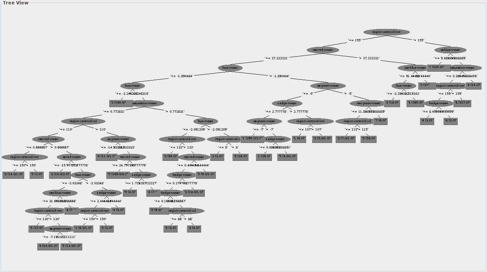
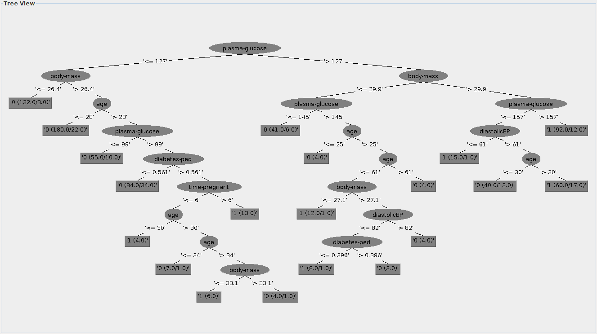

### Olive (Zone)
#### Naive Bayes

weka.classifiers.bayes.NaiveBayes

#### k-NN

weka.classifiers.lazy.IBk -K 3 -W 0 -A "weka.core.neighboursearch.LinearNNSearch -A \"weka.core.EuclideanDistance -R first-last\""

### Segment
#### Naive Bayes

Correctly Classified Instances        1849               80.0433 %
Incorrectly Classified Instances       461               19.9567 %

weka.classifiers.bayes.NaiveBayes

a   b   c   d   e   f   g   <-- classified as
321   0   0   6   3   0   0 |   a = 1
0 328   0   2   0   0   0 |   b = 2
6   0  50   8 266   0   0 |   c = 3
24   0   6 281  12   7   0 |   d = 4
62   0  12  26 230   0   0 |   e = 5
0   0   4  11   0 315   0 |   f = 6
0   0   1   0   5   0 324 |   g = 7

#### k-NN

Correctly Classified Instances        2250               97.4026 %
Incorrectly Classified Instances        60                2.5974 %

weka.classifiers.lazy.IBk -K 1 -W 0 -A "weka.core.neighboursearch.LinearNNSearch -A \"weka.core.EuclideanDistance -R first-last\""

a   b   c   d   e   f   g   <-- classified as
328   0   0   0   2   0   0 |   a = 1
0 330   0   0   0   0   0 |   b = 2
0   0 319   0  11   0   0 |   c = 3
2   0   2 315   9   2   0 |   d = 4
3   0  18   8 301   0   0 |   e = 5
0   0   0   0   0 330   0 |   f = 6
0   0   0   1   1   1 327 |   g = 7

#### C4.5

Correctly Classified Instances        2234               96.71   %
Incorrectly Classified Instances        76                3.29   %

weka.classifiers.trees.J48 -C 0.25 -M 2

a   b   c   d   e   f   g   <-- classified as
327   0   1   0   2   0   0 |   a = 1
0 330   0   0   0   0   0 |   b = 2
1   1 310   2  16   0   0 |   c = 3
2   0   2 306  19   0   1 |   d = 4
2   0  18   8 302   0   0 |   e = 5
0   0   0   0   0 330   0 |   f = 6
0   0   0   0   0   1 329 |   g = 7

long

#### SVMs
SUPER MEGA TROP LONG (1 element / seconde)

Alors cross-validation passage de 2310 elements à 10 elements

Correctly Classified Instances        1510               65.368  %
Incorrectly Classified Instances       800               34.632  %

weka.classifiers.functions.LibSVM -S 0 -K 2 -D 3 -G 0.0 -R 0.0 -N 0.5 -M 40.0 -C 1.0 -E 0.001 -P 0.1 -seed 1

a   b   c   d   e   f   g   <-- classified as
241   0   0  59   0   0  30 |   a = 1
0 169   0 111   0   0  50 |   b = 2
0   0 181  98   8   0  43 |   c = 3
1   0   0 278   0   0  51 |   d = 4
0   0   9  89 188   0  44 |   e = 5
0   0   0  77   0 221  32 |   f = 6
0   0   0  98   0   0 232 |   g = 7

### Diabetes
#### Naive Bayes

Correctly Classified Instances         581               75.651  %
Incorrectly Classified Instances       187               24.349  %

weka.classifiers.bayes.NaiveBayes

a   b   <-- classified as
420  80 |   a = 0
107 161 |   b = 1

#### k-NN

Correctly Classified Instances         578               75.2604 %
Incorrectly Classified Instances       190               24.7396 %

weka.classifiers.lazy.IBk -K 7 -W 0 -A "weka.core.neighboursearch.LinearNNSearch -A \"weka.core.EuclideanDistance -R first-last\""

a   b   <-- classified as
429  71 |   a = 0
119 149 |   b = 1

#### C4.5

weka.classifiers.trees.J48 -C 0.25 -M 2

Correctly Classified Instances         567               73.8281 %
Incorrectly Classified Instances       201               26.1719 %

 a   b   <-- classified as
 408  92 |   a = 0
 109 159 |   b = 1

#### SVMs

weka.classifiers.functions.LibSVM -S 0 -K 2 -D 3 -G 0.0 -R 0.0 -N 0.5 -M 40.0 -C 1.0 -E 0.001 -P 0.1 -seed 1

Correctly Classified Instances         500               65.1042 %
Incorrectly Classified Instances       268               34.8958 %

a   b   <-- classified as
500   0 |   a = 0
268   0 |   b = 1

### Satimage
#### Naive Bayes

weka.classifiers.bayes.NaiveBayes

Correctly Classified Instances        3528               79.549  %
Incorrectly Classified Instances       907               20.451  %

a   b   c   d   e   f   <-- classified as
848   1  35   0 188   0 |   a = 1
15 428   0   3  30   3 |   b = 2
17   0 858  80   1   5 |   c = 3
7   0  63 263  10  72 |   d = 4
54   3   0  14 347  52 |   e = 5
0   0   8 198  48 784 |   f = 7

#### k-NN

K = 3

weka.classifiers.lazy.IBk -K 3 -W 0 -A "weka.core.neighboursearch.LinearNNSearch -A \"weka.core.EuclideanDistance -R first-last\""

Correctly Classified Instances        4025               90.7554 %
Incorrectly Classified Instances       410                9.2446 %

a    b    c    d    e    f   <-- classified as
1045    1   17    2    7    0 |    a = 1
1  469    0    2    6    1 |    b = 2
5    1  903   43    0    9 |    c = 3
1    5   68  288    5   48 |    d = 4
18    3    1    7  411   30 |    e = 5
0    0   26   76   27  909 |    f = 7

#### C4.5

Correctly Classified Instances        3821               86.1556 %
Incorrectly Classified Instances       614               13.8444 %

weka.classifiers.trees.J48 -C 0.25 -M 2

a    b    c    d    e    f   <-- classified as
1026    5   19    4   17    1 |    a = 1
5  447    1    5   17    4 |    b = 2
8    2  867   60    1   23 |    c = 3
9    3   67  221   13  102 |    d = 4
35    7    5   12  372   39 |    e = 5
3    2   29   87   29  888 |    f = 7

#### SVMs

Correctly Classified Instances        1111               25.0507 %
Incorrectly Classified Instances      3324               74.9493 %

weka.classifiers.functions.LibSVM -S 0 -K 2 -D 3 -G 0.0 -R 0.0 -N 0.5 -M 40.0 -C 1.0 -E 0.001 -P 0.1 -seed 1

a    b    c    d    e    f   <-- classified as
1072    0    0    0    0    0 |    a = 1
479    0    0    0    0    0 |    b = 2
961    0    0    0    0    0 |    c = 3
415    0    0    0    0    0 |    d = 4
470    0    0    0    0    0 |    e = 5
999    0    0    0    0   39 |    f = 7

### Spam
#### Naive Bayes

#### k-NN

#### C4.5

#### SVMs
