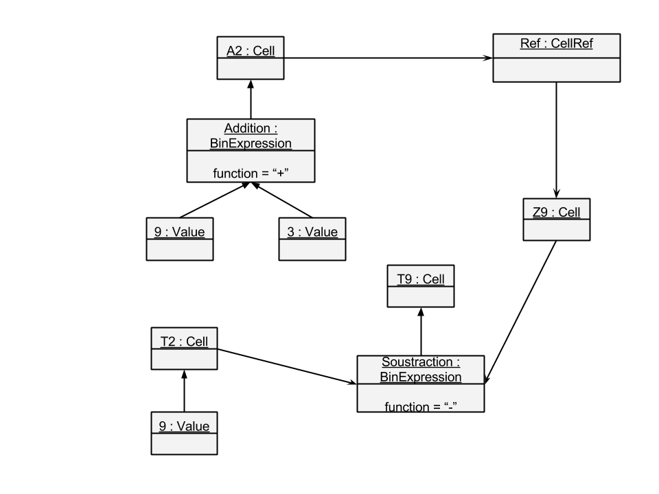
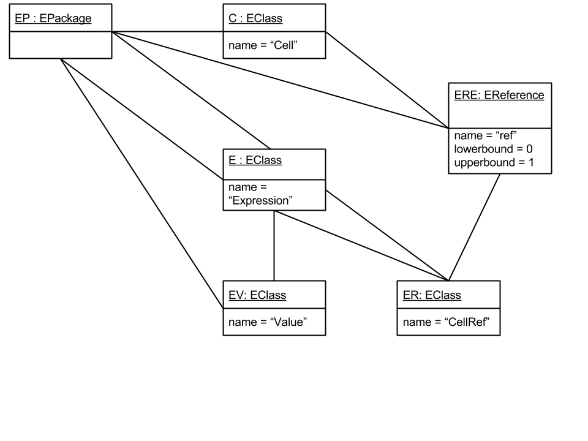

# Ingénierie des Modèles (IDM)

## 1. Un métamodèle de tableur
Q1.



## 2. Introduction à Ecore
Q2.


Q4. Le Meta-Model de tableur est conforme à Ecore. Une des propriété des Meta-Meta-Model est d'être bootstap, Ecore peut s'auto-définir.

## 3. Transformation de modèles
Q5.  
Flat
---
```java
p = package
for (c in p.eclassfiers) {
    if (c instanceof EClass) {
        cl = (EClass) c
        print cl.name
        if (cl.eSuperTypes.size() > 0) {
            for (scl in cl.eSuperTypes) {
                print scl.name
            }
        }
    }
}
```
