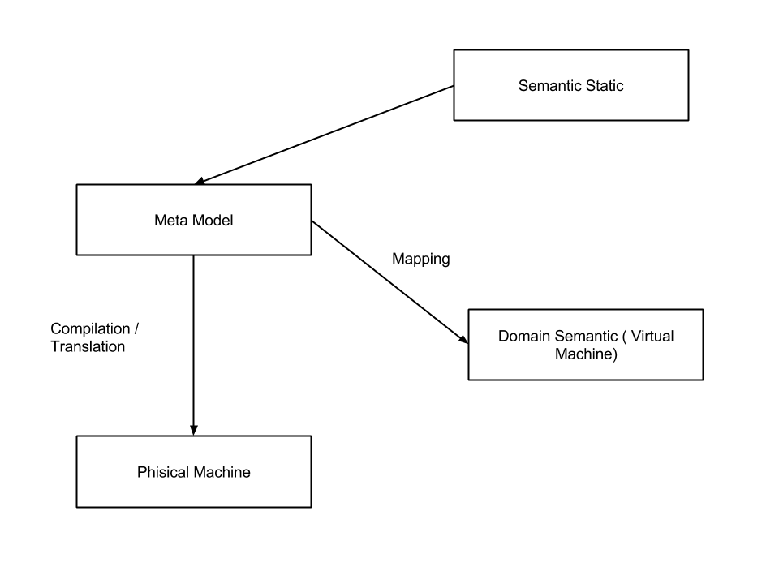
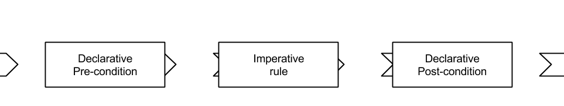
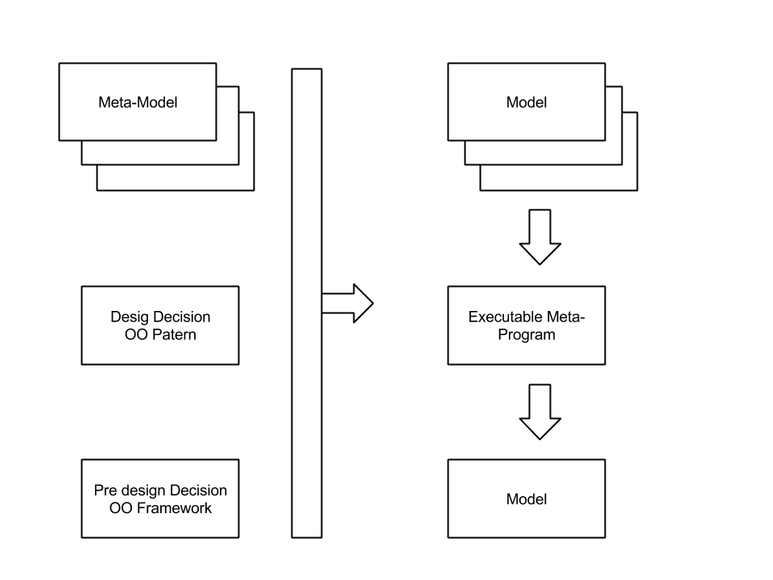
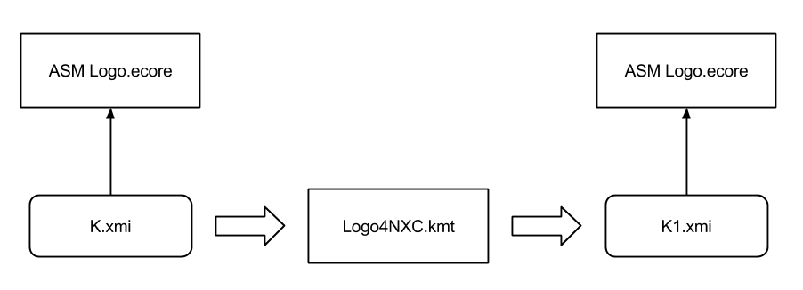
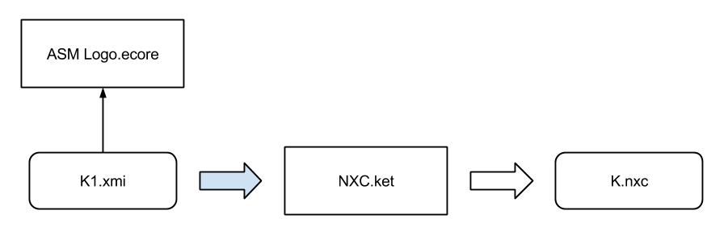

# Model Driven Language Engineering : The Process

## Workflow

* Specify abstract syntax
* Specify concrete syntax
* Build specific editor
* Specify static semantics
* specify dynamic semantics
* Build simulator
* Compile to a specific platform

## Build a Meta-Model for LOGO

* Block
    * Instruction
        * Condition
        * Right
        * Forward
        * ... (Basic Commands)
* Procedure Definition
* Procedure Call
    * Expression
        * Constante
        * Variable
* Formal
* Effective

## Build a Compilator

* Interpretation of Meta-Model
    * Mapping on Semantic Domain (Virtual Machine)
    * Compilation / Translation on Hard (Phisical) Machine

### Translation / Compilation

Two different target for a translation, Model To Text & Model To Model.

#### Text
* Rendu
    * Code
    * Doc
    * Xml
    * Text
* Method
    * Syntactic level transcoding
        * Method based on Visitor with iterator & write / print. Problems with control of production
        * Method based on Template. Define a template who will be filled with specific result.
    * For Simple cases, use the template mecanism
    * QVT (Query / Views / Transformations RFP)
        * Query
        * Views (Apply model update on views). Only on Read-Only
        * Transformations generate model from source. May be bi-directional

#### Model

* Rendu
    * Model
    * Class
* Method
    * Refactoring Model
    * Declarative (what to do)
        * Invariant relations between source and target models
    * Imperative (how to do it)
        * How to derive a target from a source
    * Dedicated model Transformation tools
        * Depend on how many developers are familiar with the prolog-like style of rules writing ?
        * Where is the advantage of a dedicated explicit language vs a general purpose language ?
        * Hybrid Languages or transformation libraries for general purpose languages...
    * M2M transformations as OO Programs
        * could be write in java 10
        * Xtend
        * 

## Logo to NXC Compiler

* Step 1 - Model-to-Model transformation

* Step 2 - Code generation with template

## Logo Summary
* Integrate all aspects coherently (syntax / semantics / tools)
* Use appropriate languages
    * MOF for abstract syntax
    * OCL for test
    * Kermata
    * java
* Keep separation between concerns (for maintainability and evolution)
