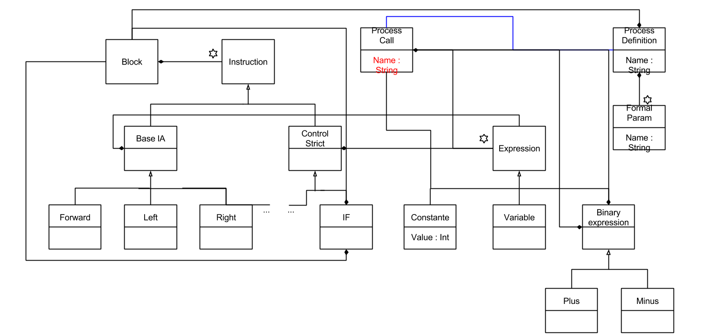

# Model Driven Language Engineering : The Process

* Specify abstract syntax
* Specify concrete syntax
* Build specific editor
* Specify static semantics
* specify dynamic semantics
* Build simulator
* Compile to a specific platform

Build a meta-model for LOGO

* Block
    * Instruction
        * Condition
        * Right
        * Forward
        * ... (Basic Commands)
* Procedure Definition
* Procedure Call
    * Expression
        * Constante
        * Variable
* Formal
* Effective

