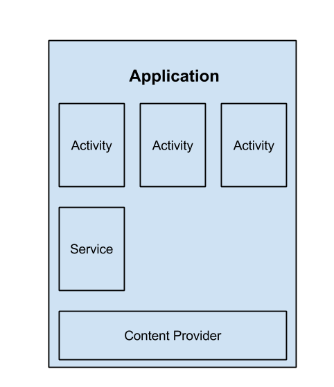

# Android

* Chaque vue est une application (Activity)
* Fichier AndroidManifest.xml permet de gérer les droits/accès nécessaires pour faire fonctionner l'application

Vues :
  * IHM statique en XML
  * IHM dynamique en Java  

Métier :
  * Développement surtout en Java et XML (parfois C/C++)

## Les applications Android
Une fois compilé : .apk (archive) --> installation d'un package sur la machine.  

Android : orienté *composants* (**activités**(vues), **services**(code en tâche de fond), **récepteurs** (notifications), **fournisseurs de contenu**(partager des données entre les applications))  

### Activity
#### Cycle de vie
* 3 états (active, en pause, arrêtée)
* Le système peut décider de détruire une activité arrêtée et de relancer une activité arrêtée.
* 3 cycles à prendre en compte

### Services
* Permet de gérer du code en arrière plan

### BroadcastReceiver
* Reçoivent et traitent des messages broadcaster à l'ensemble des applications (ex: "batterie faible" --> Sauvegarder l'état de l'application)
* Permet de gérer les notifications

### Content Provider
* Permet d'offrir un certain nombre de données d'une application à d'autres applications
* Forme d'API qui permet d'avoir accès à des données locales ou bien distantes.

## Intent
* Permettent d'étale des liens en temps réel entre les applications
* Les intent peuvent viser :
  * une application en particulier : **intent Explicite**
  * une application non nommée : **intent Implicite**
* Une intent est un objet contenant certaines données (nom du composant destinaire si intent explicite, type d'action à effectuer ,un champ de données, des catégories, un champ extra, un champ flags)

## Architecture Android
* Une approche par composants
* Une communication asynchrone par *Intent*
* Un cycle de vie applicatif spécifique
